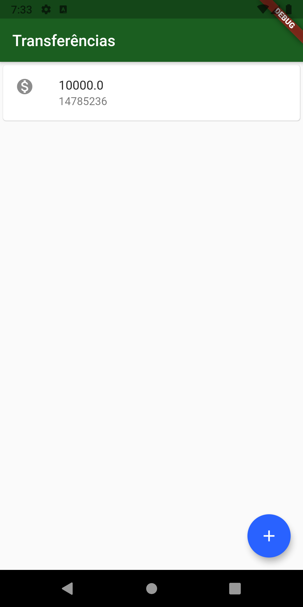
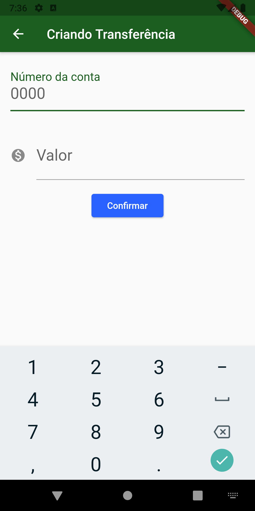

<h1 align="center">
  Bytebank
</h1>
<p align="center">
  
  <a href="https://github.com/gustavocarvalhoti/flutter/commits/main">
    
  </a>
  <br>
  <a href="https://www.linkedin.com/in/gustavocarvalho-ti/">
      
  </a> 
</p>
<strong>
<br>
<p align="center">
  <a href="#bookmark-about">About</a>&nbsp;&nbsp;&nbsp;|&nbsp;&nbsp;&nbsp;
  <a href="#computer-technologies">Technologies</a>&nbsp;&nbsp;&nbsp;|&nbsp;&nbsp;&nbsp;
  <a href="#wrench-tools">Tools</a>&nbsp;&nbsp;&nbsp;|&nbsp;&nbsp;&nbsp;
  <a href="#package-installation">Installation</a>&nbsp;&nbsp;&nbsp;|&nbsp;&nbsp;&nbsp;
  <a href="#memo-license">License</a>
</p>
</strong>
<br>

<p align="center">
    

</p>

## :bookmark: About

**Bytebank** is a app for test Flutter.

## :computer: Technologies

- **[Flutter](https://flutter.dev/)**
- **[Material Components widgets](https://flutter.dev/docs/development/ui/widgets/material)**

## :wrench: Tools

- **[IntelliJ](https://www.jetbrains.com/)**
- **[Emulator AVG](https://www.google.com/chrome/)**

## :package: Installation

### :arrow_down: **Cloning the repository**

```sh
  $ git clone https://github.com/gustavocarvalhoti/flutter.git
```

### :arrow_forward:    **Running the applications**

- :package: API

```sh
  $ sudo snap install flutter --classic
  
  $ flutter
  $ flutter doctor
  $ flutter create bytebank                     #<- Create the project
  $ flutter emulators                           #<- Verify
  $ flutter emulators --launch Pixel_3_API_28   #<- Start the emulator
  $ flutter run                                 #<- Start

  #Dart - https://dart.dev/get-dart
  $ sudo apt-get update
  $ sudo apt-get install apt-transport-https
  $ sudo sh -c 'wget -qO- https://dl-ssl.google.com/linux/linux_signing_key.pub | apt-key add -'
  $ sudo sh -c 'wget -qO- https://storage.googleapis.com/download.dartlang.org/linux/debian/dart_stable.list > /etc/apt/sources.list.d/dart_stable.list'
  $ sudo apt-get update
  $ sudo apt-get install dart
  $ export PATH="$PATH:/usr/lib/dart/bin"
  $ echo 'export PATH="$PATH:/usr/lib/dart/bin"' >> ~/.profile
```

## :memo: License

This project is under the **MIT** license.

## :memo: Extras

````
https://flutter.dev/ - By Google
https://flutter.dev/docs/development/ui/widgets/material
https://flutter.dev/docs/development/ui/interactive#stateful-and-stateless-widgets
The cod is on the folder /lib
````


